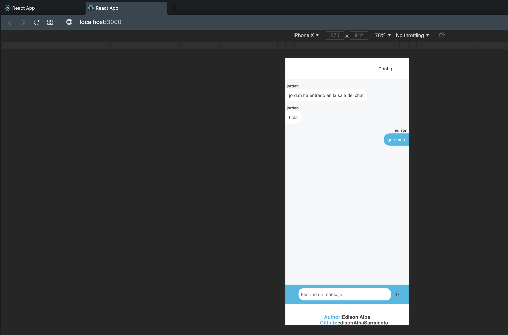
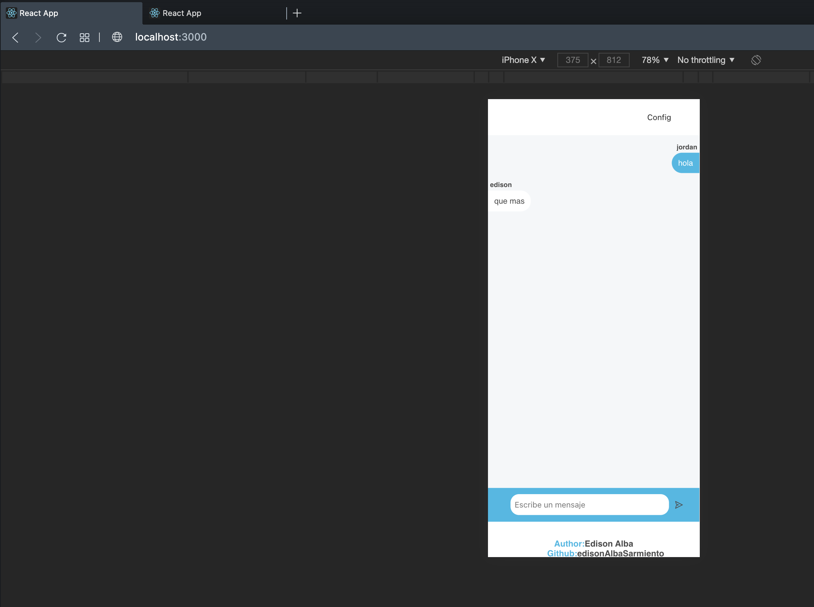

## INICIAR PROYECTO FRONT-END

* `cd front-chat-web` - ruta donde se encuentra el proyecto

* `yarn` - instalación de dependencias por primera vez

* `yarn start` - inicialización de proyecto

## INICIAR PROYECTO BACKEND

* `cd backend-chat` - ruta donde se encuentra el proyecto

* `yarn` - instalación de dependencias por primera vez

* `yarn start` - inicialización de proyecto

El backend va correr en el puerto 5000

## EVIDENCIA DE PROYECTOS INICIADOS

## SE DEBE ABRIR DOS PESTAÑAS EN EL NAVEGADOR PARA SIMULAR DOS USUARIO

como se evidencia en las siguientes imagenes:

* Pestaña 1

* Pestaña 2

## NOTA

* Se debe correr ambos proyectos para evidenciar su funcionalidad 
