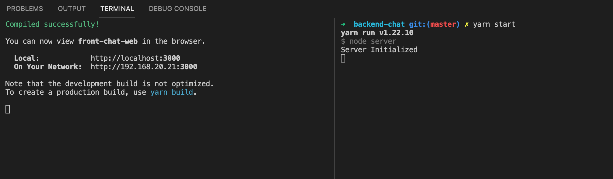

## INICIAR PROYECTO FRONT

* `cd front-chat-web` - ruta donde se encuentra el proyecto

* `yarn` - instalación de dependencias

* `yarn start` - inicialización de proyecto

## INICIAR PROYECTO FRONT

* `cd backend-chat` - ruta donde se encuentra el proyecto

* `yarn` - instalación de dependencias

* `yarn start` - inicialización de proyecto

El backend va corren en el puerto 5000

## EVIDENCIA DE PROYECTOS INICIADOS

## NOTA

* Se debe correr ambos proyectos para evidenciar su funcionalidad 
